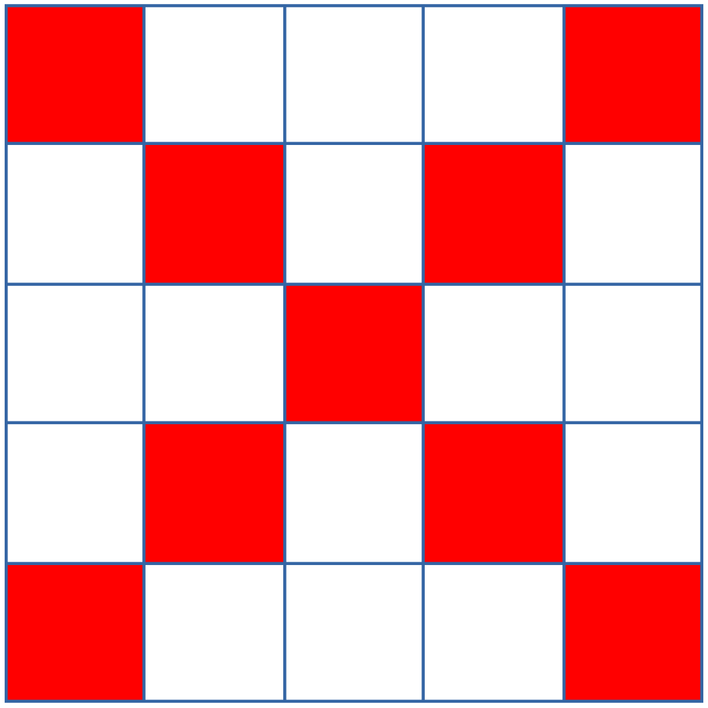
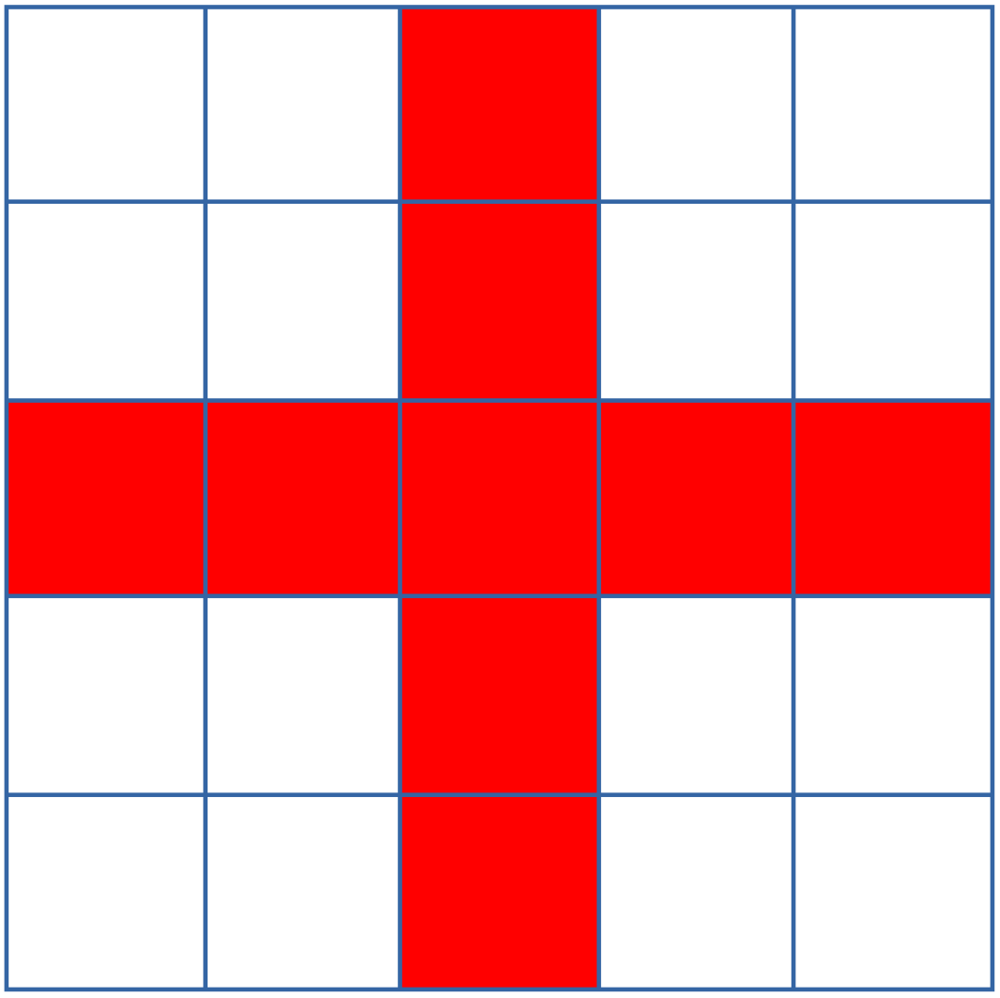
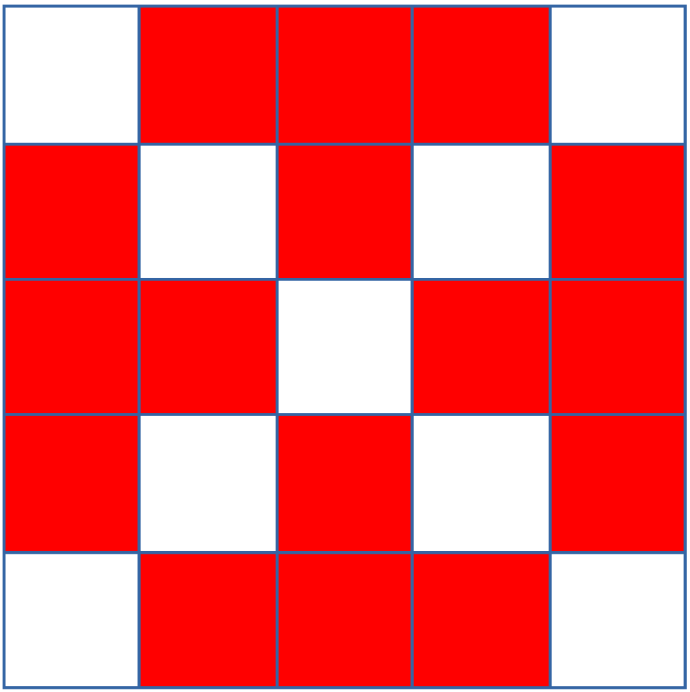
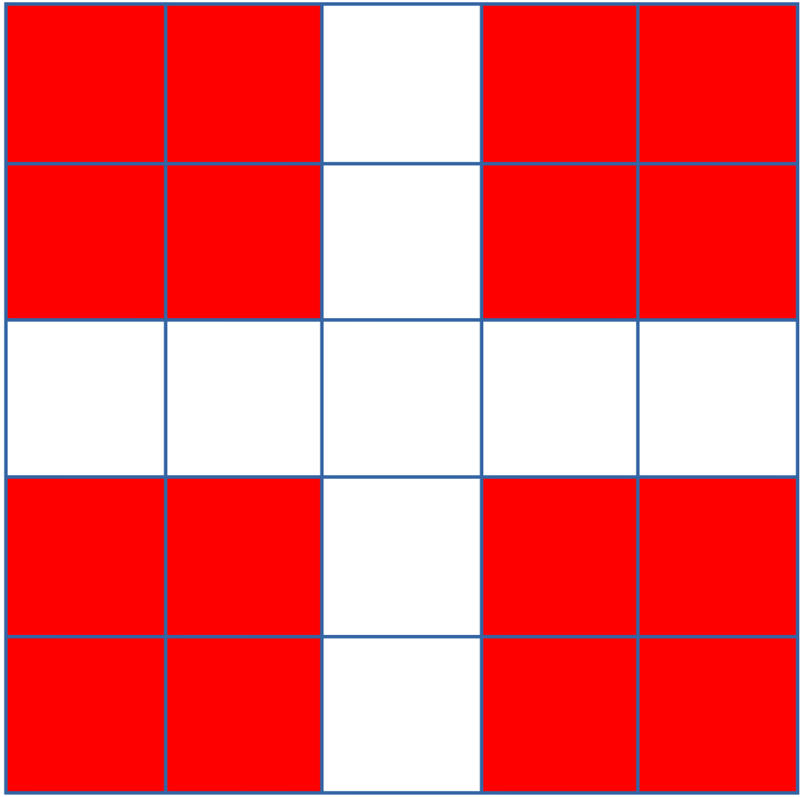
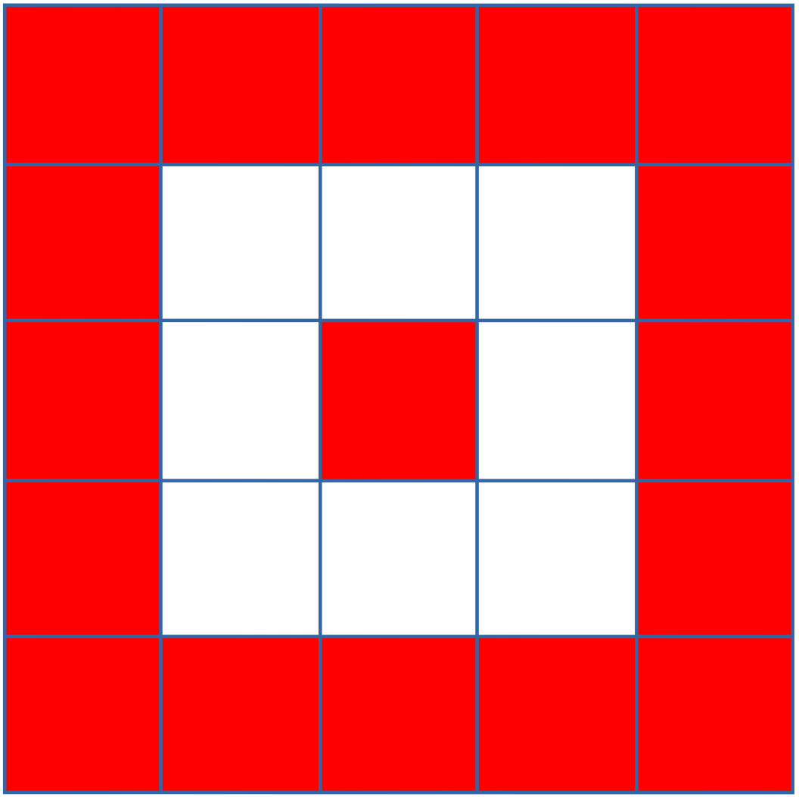
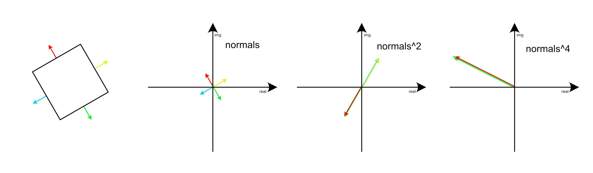

# Vision code for the New Flying Competition 22, held in Germany.







## Algorithm
The detection of squares is using an algorithm made by vision lecturer **Henrik Skov Midtiby**.

It involves treating normals from an edge detection as complex numbers, and raising them to the power of 4. When squaring a complex number it will double the length, and rotate by its angle. 

As illustrated in the image below, this causes normals that are in 90 degrees rotation shift from each other to point in a single direction, and give a high response (4 vectors pointing in same direction).




Then it is a simple matter of defining a threshold and look for high responses. 
This method is simple and effective, and as a bonus the rotation of the marker is also given.

It will be sensitive to noise in form of rectangular objects in the image that is not a marker, but luckily the assignment - finding markers in a grass field - implies a natural background, where rectangular objects are seldom found.

The identification is as simple as cropping the image to only the marker, and comparing the binary pattern to the known reference markers.


## Usage

The marker detection and identification is handled by the `marker_processing.py` script, which will read an image specified by a path, and output an annotated image in the `/outout` folder as `debug_info.png`.

To test the code, specify the image path in the code itself, and simply run the script.
```
python3 marker_processing.py
```

## Potential ToDos

- Make `vision_main.py` work, so it will run the whole pipeline (`drone_control.py` to collect images with GPS metadata, and `marker_processing.py` to process those images)
- Make `marker_processing.py` continously process multiple images in a folder
- Proper outout - Marker location (GPS data) and ID
- Better code structure
- Fix the multiprocessing
